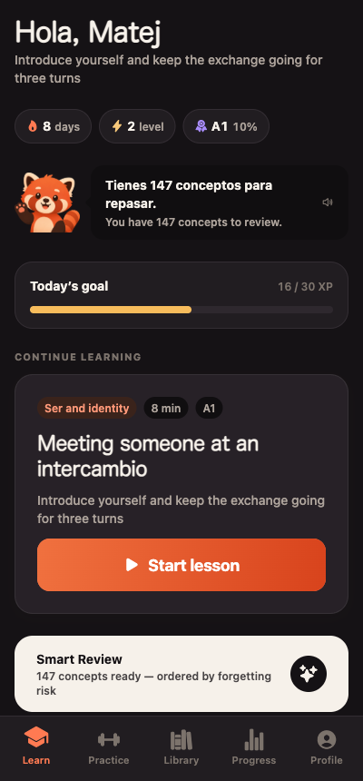
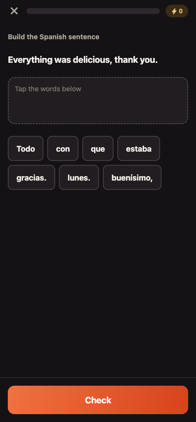
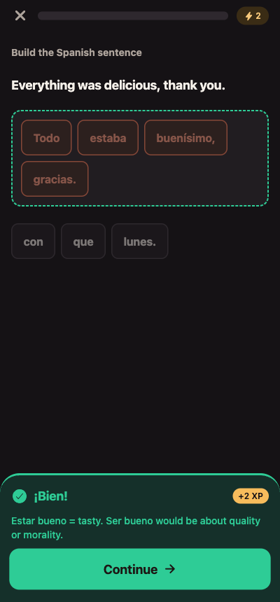
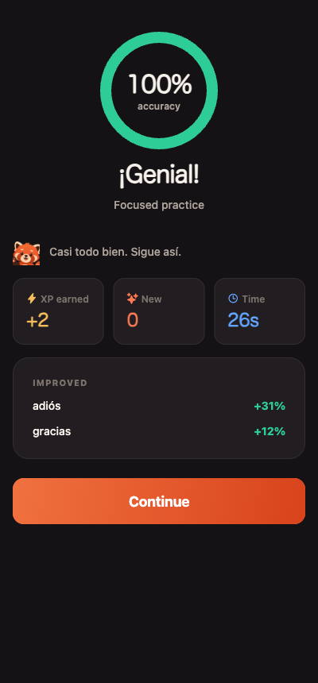
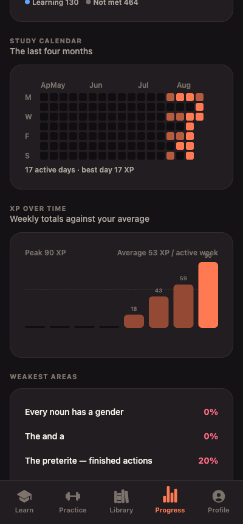
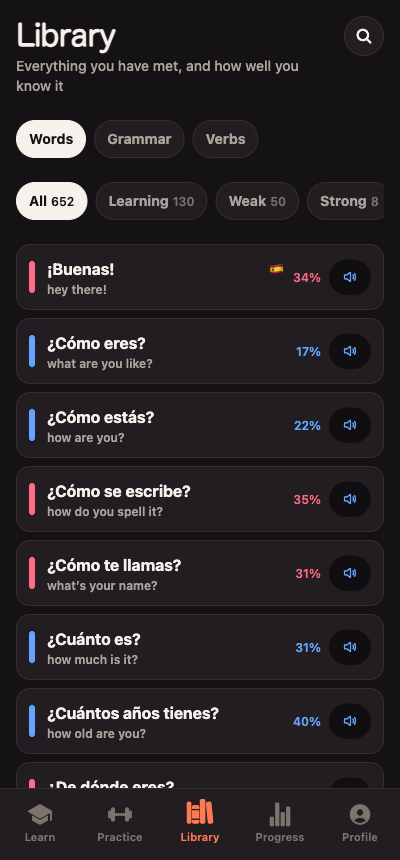
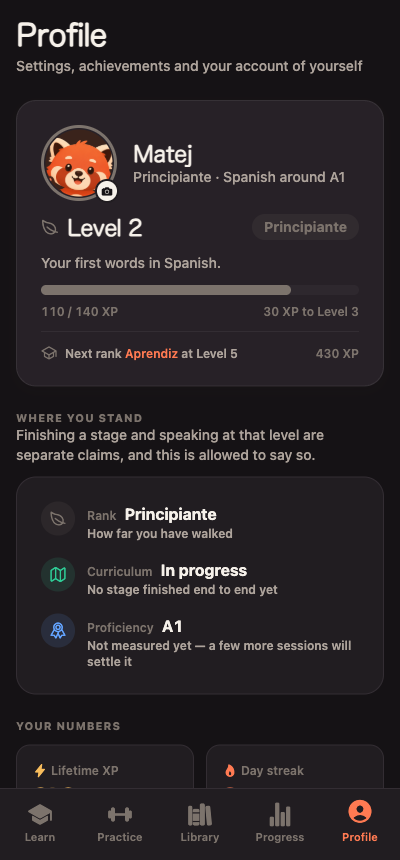

# Unolingo

A Spanish-learning app built for one learner, teaching **Peninsular Spanish (es-ES)**.

Duolingo is fun but repetitive, and better at teaching isolated words than Spanish.
A textbook teaches better but is boring enough to abandon. Unolingo is an attempt at the
overlap: engaging enough to open daily, built around how people actually acquire a language.

Expo + React Native + TypeScript. Runs on iOS, Android and web. Offline, no account, no server.

---

## What it looks like

One session, start to finish:

<table>
<tr>
<td width="25%"></td>
<td width="25%"></td>
<td width="25%"></td>
<td width="25%"></td>
</tr>
<tr>
<td align="center"><sub><b>Learn</b><br>what to do next, and how far the road runs</sub></td>
<td align="center"><sub><b>Practise</b><br>one sentence, six exercise types</sub></td>
<td align="center"><sub><b>Feedback</b><br>never scolds, always explains</sub></td>
<td align="center"><sub><b>Results</b><br>named movement, not just a score</sub></td>
</tr>
</table>

And the reference side — everything you have met, and how well you know it:

<table>
<tr>
<td width="33%"></td>
<td width="33%"></td>
<td width="33%"></td>
</tr>
<tr>
<td align="center"><sub><b>Progress</b><br>measured against yourself</sub></td>
<td align="center"><sub><b>Library</b><br>your own annotated dictionary</sub></td>
<td align="center"><sub><b>Profile</b><br>three measures, never conflated</sub></td>
</tr>
</table>

---

## What it does

**Adaptive placement.** A thirty-question test that follows you up or down the CEFR levels
after each answer, so if you already know the basics you reach B1 material in a handful of
questions instead of grinding through "hola". It estimates a level, names your weak areas,
and seeds the learner model — concepts you failed start shaky and due for review immediately.

**A real spaced-repetition model.** Every concept — a word, a grammar rule, a verb paradigm —
carries a memory record: strength, stability, ease, depth, next review. `stability` is the
number of days until predicted recall decays to the review threshold, which gives a
continuous "how likely am I to still know this" score. That curve ranks Smart Review and
spots concepts about to be lost, which a fixed interval ladder cannot.

**Progressive production.** A concept appears first as recognition, then reconstruction,
then free production. The generator reads each concept's strength and returns the shallowest
exercise that is still challenging, so you spend your time just past what you can already do.
From B2 the mix shifts again: plain multiple choice stops being evidence of anything and is
demoted to a fallback, while the exercises that make you *choose between two registers* stay
first-class.

**Difficulty calibrated per skill, not just per level.** Reading, listening, grammar and
production are tracked separately, and a skill that lags your own average gets its gentler
exercise kinds brought forward rather than being quietly dropped — which is the only way a
weak skill stops being weak.

**Exercise variety by construction.** One well-written sentence yields a translation, a word
bank, a gap fill, a dictation, a listening item and a grammar challenge. The session builder
interleaves so that no two adjacent exercises share a type — a ten-minute session genuinely
feels varied.

**Grammar that explains.** Concise cards built from a structured block format (rules,
contrasts, tables, examples, pitfalls) with an "Explain more" layer for depth on demand.

**Mistakes as data.** Every wrong answer is recorded with what you wrote, what was better and
why. Repeated confusions are grouped into patterns with a one-tap targeted drill.

**Two levels, kept apart.** Finishing the B1 material and *speaking* B1 are different claims,
so the app reports both and lets them disagree. A CEFR estimate has to be demonstrated across
listening and production, not accumulated by pressing buttons — so it will say things like
"A2+, held back by listening" rather than promoting you for turning pages.

**No hearts, no energy, no limits.** A wrong answer shortens a review interval. It never
stops you learning. Streaks are recomputed rather than punished.

Also: conversation scenes that de-guide as you improve, interactive stories, a searchable
personal dictionary annotated with your own mastery, full verb conjugations with irregular
forms highlighted, culture notes, XP that reflects effort and cannot be farmed, achievements,
and analytics that answer questions a learner would actually ask.

---

## How it feels

An app you are supposed to open every day has to be pleasant to open every day, so motion,
sound and haptics are treated as a system rather than as decoration sprinkled on at the end.

**One vocabulary, not one-off animations.** `components/ui/motion.tsx` defines the five things
a surface is allowed to do — arrive, acknowledge, refuse, count, celebrate — and every screen
composes from those. The alternative, which this replaced, was fifteen hand-tuned entrance
delays and every celebration inventing its own idea of what "pop" means.

**A reward ladder that escalates.** answer → lesson → unit → stage → level. Each rung gets
strictly more than the one below, and the top rungs are only worth anything because the lower
ones are held back:

| moment | haptic | sound | motion |
|---|---|---|---|
| an answer | yes | a short chime either way | the option pops, or the card shakes |
| a lesson finished | — | a resolving chord | results ladder, accuracy ring, XP counting up |
| a unit or stage finished | — | a bell | a milestone card, and a burst |
| a level crossed | yes | the one fanfare | the mascot reacts, the rank badge lands, and a burst |

A particle burst on a correct answer would spend the level-up, so it appears in exactly three
places in the whole app.

**Sound cues are synthesised, not sourced.** `scripts/make-sounds.mjs` generates all five as
small WAVs, which makes them licence-free, tiny, and — the actual reason — *tunable*, the same
way a colour token is. They are built from one chord so that two firing close together stack
instead of clashing, and the audio session mixes rather than taking focus: a 300ms chime should
never stop the music you were listening to.

**Reduce Motion is honoured throughout**, and not by disabling everything — entrances degrade
to a shorter crossfade, because a results screen that simply appears whole is harder to read
than one that arrives in order. The burst has no quiet form, so it is simply absent.

---

## Architecture

Three layers, deliberately kept apart:

```
src/content/     data only — no React, no logic
  types.ts       the content model
  index.ts       registry + lookups + validateContent()
  vocab/         ~650 vocabulary and phrase concepts
  sentences/     1,522 natural sentences, tagged with what they exercise
  grammar/       44 grammar concepts with deep-dive layers
  verbs.ts       43 verbs; regular forms generated, irregulars authored
  verb-corpus.ts derives which sentences contain which conjugated form
  curriculum.ts  6 stages → 63 units → 158 lessons
  conversations.ts, stories.ts, culture.ts, drills.ts, placement.ts

src/learning/    pure logic — no React, fully unit-tested
  srs.ts         spaced repetition and mastery
  mastery.ts     aggregation, weak areas, per-skill balance, CEFR estimate
  answer-check.ts smart answer validation
  generator.ts   concept + learner state → exercise
  session.ts     session assembly, ordering, interleaving
  backup.ts      what a backup is, what a restore must refuse
  migrate.ts     opening a record written by a different version of the app
  explain.ts     why the scheduler chose this exercise (developer mode)
  placement.ts, xp.ts, ranks.ts, check.ts, achievements.ts, diagnostics.ts

src/app/         Expo Router screens
src/components/  ui primitives, exercise renderers, learn components
  ui/motion.tsx  the motion vocabulary every screen composes from
src/context/     the persisted learner store
src/lib/         platform seams only — TTS, sound cues, storage, files, haptics
```

**Lessons never contain exercises.** A lesson declares what it teaches and which sentences
it may draw on; the generator builds the exercises from that plus your current state. The
same lesson is gentler the first time and harder later.

**Verb paradigms are found, not tagged.** `verb-corpus.ts` derives which sentences contain
which conjugated form by matching token sequences, so writing a sentence with "he comido" in
it makes that form practisable without anyone annotating anything.

### Adding content

1. Add words to `src/content/vocab/`, sentences to `src/content/sentences/` (tagged with the
   concepts they exercise).
2. Add a lesson to a unit in `src/content/curriculum.ts`.
3. `npm test` — `validateContent()` names anything that does not resolve.
4. `npm run audit:content` — reports where the course is thin.

Nothing else changes. That is the point of the architecture.

---

## Answer checking

Language does not have one right answer, and phone keyboards make accents a chore, so the
checker works in layers:

1. exact match against any accepted answer (case and punctuation ignored);
2. match with accents stripped — accepted, with a note naming the accents, because
   "como estas" plainly shows you understood (strict mode is a setting);
3. a near miss — graded "almost", so one slipped key does not wipe out a memory record;
4. otherwise wrong, with the model answer and an explanation.

Step 3 is the one that needs care. **A typo is a mis-keying inside a word; a grammar error is
a different word** — and in Spanish they are the same size, because inflection is one or two
letters. So the rule is about *position*: a near miss is the same number of words, exactly one
of them different, one edit apart, and the two still sharing their last two letters. Spanish
inflection lives on the end of the word, which is what keeps "pero" for "perro" a slip while
making "habla" for "hablo" an error. Measuring edit distance across the whole sentence instead
accepted "Soy cansado" for "Estoy cansado" and "la problema" for "el problema".

Spanish drops subject pronouns, so "Voy a comer ahora" and "Yo voy a comer ahora" are both
accepted — but only when the pronoun agrees with the verb. "Tú tengo un perro" is rejected,
because silently accepting a person error teaches the wrong thing.

English answers are treated as a *comprehension* check and accept any equivalent phrasing —
except that negation never counts as the word that slides, or "I don't like coffee" passes as
its own opposite.

---

## Progress is not disposable

Everything lives on the device and there is no account, which is the right trade until the
device is not around.

- **Export** hands the file to the system share sheet, so it lands somewhere that outlives the
  app — Files, iCloud, Drive, an email to yourself. **Import** picks it back up and shows you
  both states before replacing anything.
- **Three rolling snapshots**, taken twice a day and before anything destructive, so restoring
  the wrong file is itself undoable. An empty state may never displace a full one.
- **A record the app cannot read is never written over.** If a save is truncated, or written
  by a version this build does not understand, the app stops rather than starting blank —
  because starting blank is followed, moments later, by saving blank over the top.

---

## Audio

`expo-speech` with an `es-ES` voice, preferring a Castilian one where the device has it.
Offline, free, instant for new content, available on all three platforms. Normal and slow
playback; slow is always available but never the default. `src/lib/speech.ts` is the single
seam where recorded native-speaker audio would drop in.

Speaking exercises play a model, ask you to repeat, and let you self-assess — pronunciation
*scoring* needs on-device recognition, so rather than fake a score the architecture leaves a
clean slot for it. This is the largest remaining gap in the course.

Interface sound is a separate seam (`src/lib/sound.ts`, `expo-audio`) and a separate setting,
because the two are different promises: speech is content, and a chime is feedback. The rule
between the channels is that **haptics marks every interaction and sound marks a graded
outcome** — sound carries further than a vibration, so it has to earn its place more often.

---

## Commands

```bash
npx expo start                   # dev server; press i / a / w
npm test                         # 211 tests — learning logic + content integrity
npm run typecheck
npm run lint
npm run audit:content            # coverage and depth report; a gap list, not a gate
npx expo export --platform web   # bundles and statically renders every route
node scripts/make-sounds.mjs     # regenerates the interface sound cues
```

---

## State of the course

Six stages, A0 → C2, all with real content:

| Stage | Level | Units | Lessons |
|---|---|---|---|
| Foundations | A0 → A1 | 14 | 41 |
| Everyday Spanish | A1 → A2 | 15 | 31 |
| Independent Spanish | A2 → B1 | 15 | 32 |
| Conversational Fluency | B1 → B2 | 6 | 17 |
| Advanced Spanish | B2 → C1 | 7 | 18 |
| Mastery | C1 → C2 | 6 | 19 |

**63 units · 158 lessons** (67 of them optional enrichment that never blocks the path) ·
420 words · 232 phrases · 44 grammar concepts · 43 verbs across 134 conjugation paradigms ·
1,522 sentences · 25 conversation scenes · 25 stories · 12 culture notes · 110 drills ·
67 placement questions.

Enough to use for real, and structured so it can grow to ten times that without the codebase
noticing.
